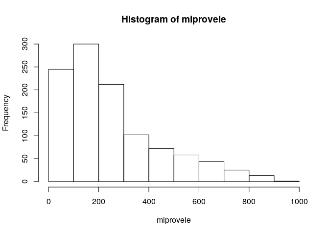

Unidad 1, asignación 2: exportar datos, leer ráster y extraer valores
=====================================================================

Sigo ayudando con `...`. Donde quiera que los veas, deberás sustituirlos por lo que indique el correspondiente mandato.

Dentro de las opciones de `knitr`, en el encabezado de este archivo, es probable que encuentres el argumento `eval = F`. Antes de tejer debes cambiarlo a `eval = T`, para que evalúe los bloques de código según tus cambios.

Provincia asignada
------------------

Toma nota del código de tu provincia asignada aleatoriamente.

``` r
 # abreviatura provaleatoria
 #       acade            11
 #       agrie            09
 #       aleir            10
 #       arqco            16
 #       cindy            12
 #       franc            23
 #       geora            08
 #       hoyod            22
 #       ingan            07
 #       ingdi            19
 #       itac9            15
 #       ivanv            25
 #       lbine            30
 #       leona            24
 #       magda            20
 #       maryj            02
 #       masue            26
 #       mmvol            13
 #       naui2            29
 #       rober            27
 #       wilne            06
 #       yoenn            21
```

Paquetes `sf`
-------------

-   Carga el paquete `sf` y el paquete `raster`.

``` r
library(sf)
## Linking to GEOS 3.7.1, GDAL 2.4.2, PROJ 5.2.0
library(raster)
## Loading required package: sp
```

Exporta
-------

-   Determina el nombre de la capa provincias con `st_layers` del archivo GeoPackage que se encuentra en la carpeta `data`.

-   Carga la capa de provincias con la función `st_read`, asignándola al objeto `prov`.

-   Genera el objeto `miprov` que sólo contenga tu provincia.

-   Usando la función `st_write`, exporta el objeto `miprov` como GeoPackage a la carpeta `data` con el nombre `miprovexportado.gpkg`.

-   Lee el archivo exportado con la función `st_read` y asígnalo al objeto `miprovexportado`. Dado que sólo tiene una capa, no tienes que especificar el argumento `layer`.

-   Imprime en pantalla el objeto `miprovexportado` (sólo necesitas escribir el nombre del objeto).

``` r
st_layers('data/divisionRD.gpkg')
## Driver: GPKG 
## Available layers:
##      layer_name geometry_type features fields
## 1 PROVCenso2010       Polygon       32      4
## 2  MUNCenso2010       Polygon      155      5
## 3  REGCenso2010       Polygon       10      2
prov <- st_read(dsn = 'data/divisionRD.gpkg', layer = 'PROVCenso2010')
## Reading layer `PROVCenso2010' from data source `/home/agrie/unidad-1-asignacion-2-rasters-y-exportar-datos-espaciales-Estebaniarosario/data/divisionRD.gpkg' using driver `GPKG'
## Simple feature collection with 32 features and 4 fields
## geometry type:  MULTIPOLYGON
## dimension:      XY
## bbox:           xmin: 182215.8 ymin: 1933532 xmax: 571365.3 ymax: 2205216
## epsg (SRID):    32619
## proj4string:    +proj=utm +zone=19 +datum=WGS84 +units=m +no_defs
miprov <- prov[prov$PROV %in% '09', ]
st_write(obj = miprov, dsn = 'data/miprovexportado.gpkg', driver = 'gpkg')
## Writing layer `miprovexportado' to data source `data/miprovexportado.gpkg' using driver `gpkg'
## Writing 1 features with 4 fields and geometry type Multi Polygon.
miprovexportado<- st_read(dsn = 'data/miprovexportado.gpkg')
## Reading layer `miprovexportado' from data source `/home/agrie/unidad-1-asignacion-2-rasters-y-exportar-datos-espaciales-Estebaniarosario/data/miprovexportado.gpkg' using driver `GPKG'
## Simple feature collection with 1 feature and 4 fields
## geometry type:  MULTIPOLYGON
## dimension:      XY
## bbox:           xmin: 330844.4 ymin: 2135541 xmax: 386551.9 ymax: 2180418
## epsg (SRID):    32619
## proj4string:    +proj=utm +zone=19 +datum=WGS84 +units=m +no_defs
miprovexportado
## Simple feature collection with 1 feature and 4 fields
## geometry type:  MULTIPOLYGON
## dimension:      XY
## bbox:           xmin: 330844.4 ymin: 2135541 xmax: 386551.9 ymax: 2180418
## epsg (SRID):    32619
## proj4string:    +proj=utm +zone=19 +datum=WGS84 +units=m +no_defs
##   PROV REG TOPONIMIA ENLACE                           geom
## 1   09  01 ESPAILLAT   0109 MULTIPOLYGON (((385993.5 21...
```

Ráster
------

-   Con la función `raster`, carga el modelo digital de elevaciones que se encuentra en la carpeta `data`. Es el único archivo de extensión `.tif` Asígnalo al objeto `mde`

-   Genera un mapa con la función `plot`, usando la paleta de colores `terrain.colors`.

``` r
mde <- raster('data/mde_rd.tif')
plot(mde, col = terrain.colors(n = 255))
```


Extraer valores del ráster
--------------------------

-   Con la función `raster::extract`, extrae los valores de elevación correspondientes a tu provincia. Utiliza `mde` como objeto ráster y `miprov` como capa zonal. Asigna los valores al objeto `miprovele`.

-   Imprime en pantalla el objeto `miprovele` (sólo necesitas escribir el nombre del objeto).

-   Obtén los estadísticos descriptivos básicos (mínimo, primer cuartil, media, mediana, tercer cuartil, máximo) de `miprovele` con la función `summary`.

-   Genera un histograma de `miprovele` usando la función `hist`.

``` r
miprovele <- raster::extract(mde, miprov)[[1]]
miprovele
##    [1]   7.080000   9.445783   9.770000   9.560000  10.472973  10.140000
##    [7]   8.410000   9.325843  11.320000   8.630000   6.990000   9.212121
##   [13]  12.850000  12.670000  11.450000  11.100000   5.580000   5.290000
##   [19]  13.910000  14.010000  44.310001  37.700001  38.430000  35.650002
##   [25]  33.700001  51.570000  30.459999  14.920000  14.010000  13.900000
##   [31]  15.080000  14.820000   8.190000   5.580000  15.410000  14.590000
##   [37]   9.660000  11.966102  90.870003  95.559998  63.080002  54.939999
##   [43]  48.820000  45.349998  51.209999  69.480003  73.360001  66.790001
##   [49]  57.529999  50.990002  25.209999  18.209999  17.330000  22.790001
##   [55]  20.459999  25.010000   8.870000  10.920000  11.060000  11.080000
##   [61]  14.440000  13.682353 164.300003 136.350006 110.949997  82.389999
##   [67]  56.160000  48.590000  75.290001  77.650002  94.290001 105.279999
##   [73] 112.169998  95.199997  63.529999  42.310001  43.389999  53.360001
##   [79]  49.680000  53.840000  37.189999  28.440001  32.070000  36.000000
##   [85]  33.200001  21.910000  11.758242   9.877193 230.160004 180.160004
##   [91] 169.029999 113.519997  97.849998  56.009998  85.459999 112.260002
##   [97] 114.739998 125.849998 140.699997 151.789993 137.440002 114.459999
##  [103]  92.879997  93.910004  92.220001  83.559998  89.260002  61.500000
##  [109]  50.630001  54.939999  53.090000  61.150002  24.990000  11.330000
##  [115]  16.500000  48.389999  45.830002  21.629999  30.230000  35.640450
##  [121]  18.629629 210.490005 224.199997 203.619995 154.139999 112.580002
##  [127]  69.180000  73.230003 124.449997 143.149994 159.940002 170.149994
##  [133] 183.589996 194.580002 178.419998 153.419998 135.869995 105.790001
##  [139]  56.619999  65.839996  98.330002  89.290001  90.669998  70.559998
##  [145]  99.400002  48.189999  22.379999  25.629999  73.720001  97.519997
##  [151]  49.900002  92.029999  92.769997  53.869999  45.160000  16.393618
##  [157]  17.730770  11.285714  10.530000 246.820007 246.419998 246.429993
##  [163] 228.550003 178.080002 163.410004 107.830002  71.529999  98.550003
##  [169] 141.250000 173.869995 198.679993 192.580002 199.500000 194.509995
##  [175] 185.669998 193.000000 190.539993  92.300003  46.400002  92.080002
##  [181] 147.350006 123.339996 117.360001 141.429993  66.790001  24.629999
##  [187]  29.100000  59.869999  93.209999  93.419998 127.709999 163.070007
##  [193] 133.990005  90.300003  54.360001  60.290001  14.160000  12.209302
##  [199]  11.111111  11.771930  10.958333  15.636364  13.209877  12.917526
##  [205]   8.430000   9.550000   8.710000  12.160000 261.299988 280.059998
##  [211] 244.080002 263.799988 227.270004 173.050003 155.449997 148.470001
##  [217]  93.459999 119.669998 165.550003 200.889999 218.729996 205.210007
##  [223] 204.339996 217.479996 261.260010 266.929993 236.929993  82.949997
##  [229]  73.669998 149.000000 181.089996 192.190002 163.449997  69.300003
##  [235]  36.790001  37.040001  65.750000  95.970001  96.849998  82.019997
##  [241]  87.099998  70.160004  47.590000  65.500000  59.590000  29.520000
##  [247]  18.650000  17.040001  13.340000  23.170000  36.860001  23.049999
##  [253]  21.580000  90.629997  32.540001  19.549999  14.260000 287.160004
##  [259] 295.559998 270.600006 307.890015 289.679993 233.279999 211.029999
##  [265] 152.570007 107.860001 118.150002 144.580002 195.160004 214.350006
##  [271] 238.119995 239.300003 262.079987 315.660004 326.709991 307.220001
##  [277] 132.860001  73.739998 117.330002 227.589996 254.949997 157.710007
##  [283]  83.139999  41.910000  86.610001 138.740005 146.649994 106.690002
##  [289]  96.570000  82.309998  59.250000  45.709999  54.470001  57.340000
##  [295]  39.980000  42.139999  60.380001  89.040001  78.059998  95.120003
##  [301]  73.019997  46.080002  97.360001  44.590000  26.570000  26.000000
##  [307]  26.090000 319.829987 299.989990 324.959991 318.880005 275.399994
##  [313] 225.830002 176.860001 125.690002 168.289993 145.050003 180.720001
##  [319] 216.440002 249.660004 278.869995 307.660004 356.859985 357.149994
##  [325] 358.070007 183.529999  94.889999 105.459999 205.130005 271.750000
##  [331] 154.630005 117.250000  78.139999  81.260002 107.839996 144.529999
##  [337] 170.820007 141.789993 117.180000  96.580002  71.309998 138.750000
##  [343] 123.790001  66.550003  64.080002  71.290001 153.789993 127.000000
##  [349] 140.639999 130.110001  95.669998  55.430000  39.849998  43.099998
##  [355]  33.349998 366.519989 336.230011 323.179993 341.390015 287.209991
##  [361] 224.860001 163.649994 142.899994 198.139999 166.539993 172.600006
##  [367] 248.830002 269.570007 306.959991 349.739990 382.239990 373.350006
##  [373] 375.410004 218.000000  93.809998 109.790001 179.410004 270.820007
##  [379] 187.580002 118.760002  78.559998  67.290001 138.169998 193.850006
##  [385] 189.710007 208.330002 190.619995 123.070000 126.070000 173.750000
##  [391] 201.089996 171.960007 190.309998 121.699997 116.949997 136.309998
##  [397] 120.800003  99.720001  97.379997  57.709999  62.779999  41.720001
##  [403]  36.270000 464.989990 373.299988 350.890015 343.100006 280.369995
##  [409] 252.149994 223.360001 183.320007 234.000000 214.279999 178.350006
##  [415] 197.660004 229.869995 267.570007 305.559998 275.720001 257.619995
##  [421] 264.609985 162.199997  90.860001 105.580002 157.210007 205.970001
##  [427] 194.589996 104.750000  70.589996  83.550003 144.470001 147.779999
##  [433] 119.669998 136.600006 207.740005 190.050003 195.240005 217.750000
##  [439] 287.399994 301.910004 301.269989 254.690002 204.190002 106.080002
##  [445]  82.410004  89.620003  77.660004  51.700001  35.709999  26.500000
##  [451] 554.849976 517.179993 406.619995 395.820007 345.119995 297.359985
##  [457] 272.119995 224.820007 191.350006 236.720001 251.710007 190.389999
##  [463] 232.000000 294.839996 262.209991 318.010010 299.920013 293.869995
##  [469] 357.209991 236.070007 119.769997  98.830002 140.350006 197.649994
##  [475] 153.990005  97.629997  95.110001  74.750000  97.309998 119.389999
##  [481] 154.809998 175.160004 149.119995 197.449997 249.320007 346.529999
##  [487] 387.459991 361.059998 239.100006 320.709991 170.800003 110.540001
##  [493] 159.880005 140.869995  69.449997  48.720001 638.190002 607.000000
##  [499] 580.030029 528.799988 452.000000 424.470001 331.200012 308.269989
##  [505] 281.059998 212.720001 279.220001 280.690002 227.199997 194.380005
##  [511] 302.609985 329.950012 363.959991 445.559998 468.290009 347.010010
##  [517] 277.160004 263.459991 168.139999 103.870003 156.020004 213.529999
##  [523] 161.740005 134.610001 135.789993  85.800003 121.129997 121.339996
##  [529] 158.940002 231.690002 253.899994 255.720001 339.559998 341.489990
##  [535] 390.000000 387.390015 210.869995 230.720001 218.190002 171.619995
##  [541] 131.169998  77.540001  58.290001 666.760010 638.299988 616.270020
##  [547] 568.390015 534.460022 495.850006 365.880005 301.940002 274.290009
##  [553] 240.229996 320.820007 355.260010 297.929993 223.169998 235.460007
##  [559] 326.089996 360.369995 379.410004 453.950012 474.589996 457.149994
##  [565] 331.209991 245.020004 159.039993 118.629997 203.169998 166.389999
##  [571] 193.580002 128.389999 111.669998 139.009995 124.690002 191.800003
##  [577] 251.149994 368.109985 427.019989 283.920013 215.320007 207.869995
##  [583] 201.710007 136.649994 127.580002 109.209999 103.250000 713.190002
##  [589] 681.010010 650.690002 619.320007 582.309998 563.570007 524.659973
##  [595] 402.220001 444.500000 347.089996 315.220001 388.890015 346.100006
##  [601] 261.929993 330.190002 374.010010 398.390015 479.690002 468.660004
##  [607] 482.059998 470.640015 355.299988 218.940002 163.479996 142.339996
##  [613] 134.470001 210.770004 186.089996 177.009995 247.380005 400.049988
##  [619] 403.589996 317.720001 751.830017 734.020020 694.520020 668.239990
##  [625] 625.429993 592.190002 575.859985 486.049988 497.730011 325.440002
##  [631] 357.790009 425.390015 363.519989 280.209991 306.220001 398.700012
##  [637] 488.649994 497.179993 513.710022 519.840027 251.089996 200.669998
##  [643] 147.589996 221.240005 249.899994 310.559998 313.070007 316.429993
##  [649] 422.450012 515.119995 455.100006 803.530029 780.650024 722.289978
##  [655] 688.770020 643.590027 622.700012 572.380005 556.799988 528.489990
##  [661] 363.670013 424.640015 459.739990 315.109985 542.539978 562.440002
##  [667] 286.760010 263.929993 234.979996 361.649994 423.970001 439.529999
##  [673] 496.899994 540.700012 642.820007 573.429993 880.989990 808.570007
##  [679] 745.450012 702.440002 672.200012 640.650024 632.140015 634.039978
##  [685] 599.049988 459.540009 541.890015 428.739990 549.679993 569.960022
##  [691] 452.059998 510.239990 569.450012 620.140015 635.469971 705.750000
##  [697] 662.919983 824.280029 903.820007 870.700012 804.530029 754.609985
##  [703] 731.859985 667.419983 658.109985 692.679993 561.250000 487.070007
##  [709] 575.419983 433.920013 599.250000 611.130005 591.950012 657.250000
##  [715] 654.979980 751.469971 860.900024 869.760010 817.539978 754.719971
##  [721] 706.770020 674.320007 638.500000 500.269989 614.140015 510.329987
##  [727] 575.169983 628.090027 688.260010 749.130005 798.419983 814.510010
##  [733] 774.400024 731.390015 723.460022 567.419983 614.419983 505.779999
##  [739] 403.329987 430.670013 469.010010 540.070007 517.000000 554.549988
##  [745] 559.799988 626.880005 778.510010 836.460022 769.679993 770.119995
##  [751] 603.010010 736.890015 584.479980 410.440002 330.440002 432.350006
##  [757] 486.489990 543.690002 554.039978 520.690002 452.829987 461.440002
##  [763] 521.489990 659.570007 860.429993 807.489990 745.900024 674.640015
##  [769] 717.900024 523.789978 496.470001 440.220001 276.529999 372.140015
##  [775] 441.480011 441.940002 480.440002 479.529999 419.350006 404.769989
##  [781] 473.369995 525.940002 693.450012 674.520020 629.090027 713.690002
##  [787] 619.299988 576.349976 536.619995 455.829987 237.910004 279.170013
##  [793] 340.109985 377.279999 404.959991 420.980011 362.079987 420.149994
##  [799] 419.299988 430.369995 461.760010 474.089996 473.559998 567.330017
##  [805] 632.739990 673.929993 580.909973 476.920013 228.690002 244.559998
##  [811] 267.160004 284.649994 307.760010 351.329987 369.500000 398.250000
##  [817] 373.299988 378.769989 391.730011 399.420013 414.769989 465.029999
##  [823] 486.119995 599.549988 560.679993 517.590027 221.699997 231.139999
##  [829] 242.449997 253.970001 266.750000 274.329987 302.940002 331.029999
##  [835] 352.519989 332.940002 354.339996 364.130005 400.029999 407.739990
##  [841] 419.690002 515.239990 552.880005 593.239990 208.160004 210.979996
##  [847] 216.669998 226.259995 234.089996 244.169998 256.029999 260.750000
##  [853] 270.649994 292.820007 294.529999 302.290009 308.570007 338.760010
##  [859] 363.269989 387.059998 415.829987 445.140015 580.729980 194.119995
##  [865] 200.139999 200.690002 203.179993 212.110001 220.619995 232.449997
##  [871] 241.699997 245.550003 243.179993 252.830002 262.570007 263.170013
##  [877] 262.970001 288.739990 307.510010 324.109985 344.940002 407.170013
##  [883] 192.009995 192.330002 194.520004 202.479996 209.839996 220.470001
##  [889] 226.839996 227.800003 227.070007 236.339996 244.429993 242.270004
##  [895] 234.949997 253.470001 265.359985 283.140015 313.209991 362.779999
##  [901] 183.679993 183.289993 186.990005 194.740005 201.350006 206.110001
##  [907] 211.369995 210.820007 215.759995 223.160004 228.889999 228.899994
##  [913] 223.789993 237.509995 240.550003 243.949997 262.679993 294.739990
##  [919] 174.449997 178.139999 181.820007 185.350006 190.179993 194.699997
##  [925] 198.449997 197.660004 206.460007 209.429993 212.600006 215.229996
##  [931] 212.250000 226.350006 226.850006 236.500000 248.559998 255.309998
##  [937] 167.119995 172.570007 175.130005 176.740005 178.960007 182.179993
##  [943] 182.020004 186.419998 192.789993 195.600006 202.850006 201.020004
##  [949] 207.369995 211.440002 217.850006 222.509995 227.850006 159.380005
##  [955] 165.880005 165.899994 167.160004 164.789993 163.119995 173.889999
##  [961] 188.809998 188.190002 190.600006 193.800003 195.229996 194.350006
##  [967] 202.419998 207.660004 211.729996 211.059998 163.910004 161.960007
##  [973] 161.979996 162.990005 158.360001 156.199997 160.910004 169.649994
##  [979] 174.279999 177.080002 180.610001 183.869995 184.339996 185.630005
##  [985] 187.729996 194.949997 199.639999 204.080002 206.289993 174.130005
##  [991] 177.399994 178.649994 180.089996 197.839996 191.820007 173.949997
##  [997] 158.860001 155.889999 158.559998 167.910004 172.330002 175.580002
## [1003] 174.160004 176.350006 183.630005 188.279999 190.979996 195.220001
## [1009] 189.020004 192.720001 209.860001 222.820007 206.679993 186.580002
## [1015] 170.399994 153.619995 157.000000 162.729996 167.990005 168.449997
## [1021] 165.490005 174.309998 176.229996 177.270004 184.479996 181.360001
## [1027] 198.759995 216.380005 230.229996 217.910004 192.080002 170.919998
## [1033] 153.789993 149.779999 150.360001 153.639999 158.229996 162.169998
## [1039] 155.899994 166.070007 166.339996 170.399994 178.309998 225.830002
## [1045] 204.369995 178.630005 160.580002 148.009995 132.160004 138.910004
## [1051] 152.830002 147.919998 155.429993 157.610001 165.360001 173.179993
## [1057] 139.119995 145.110001 150.410004 152.460007 159.880005 138.500000
## [1063] 140.279999 143.139999 140.630005 131.839996 133.419998 124.720001
## [1069] 125.540001 115.190002 121.660004 118.330002
summary(miprovele)
##    Min. 1st Qu.  Median    Mean 3rd Qu.    Max. 
##    5.29  115.08  197.66  250.69  341.42  903.82
hist(miprovele)
```


